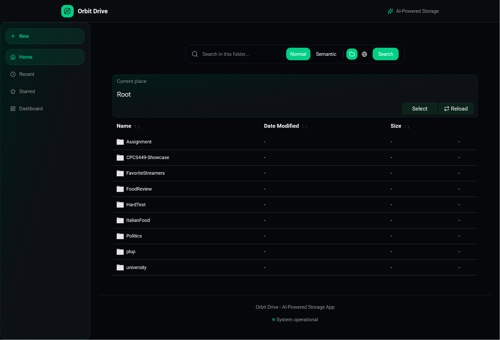
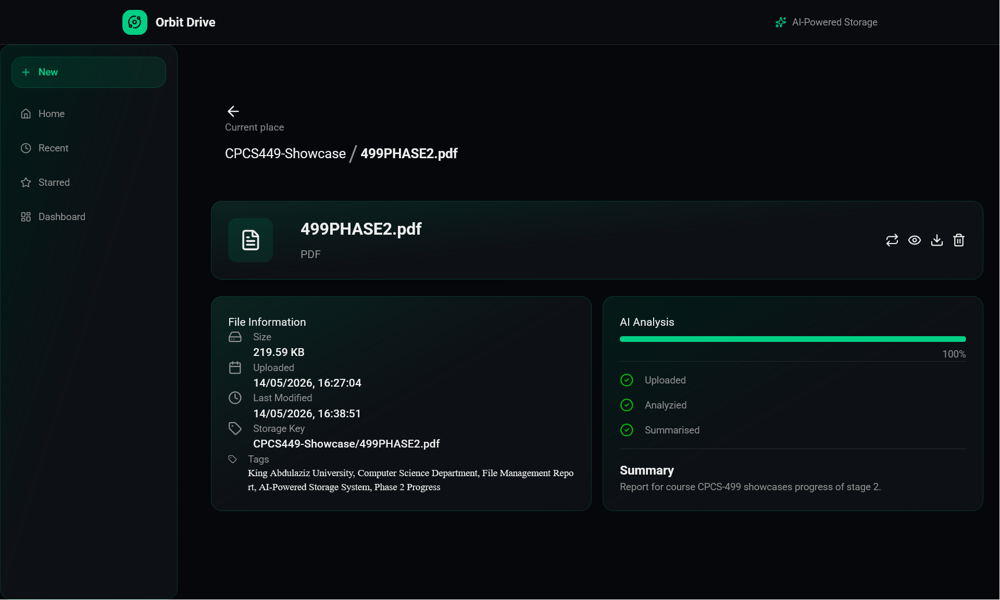

# Orbit Drive

Orbit Drive is a self-hosted file system for organizations that want to manage their data on a private network.

It allows teams to store files, organize them with tags, search using simple language, and generate short summaries for text and audio content.

## Features

- Local, self-hosted storage
- File tagging for better organization
- Search based on meaning, not just file names
- Text and audio summarization
- Private and controlled data environment

## Why Orbit Drive?

Many teams struggle with scattered files and poor search. Orbit Drive keeps everything in one place and makes it easier to find and understand information without relying on external cloud services. No need to subscribe for cloud services and worrying about price changing and getting your data used in Ai Training. 

## Snippets 

## Getting Started

1. Set up the server on your local network  
2. Upload files through the web interface  
3. Add tags or let the system organize content  
4. Use search to quickly find what you need  

## Notes

Orbit Drive is designed to be simple, practical, and easy to use within an organization.
